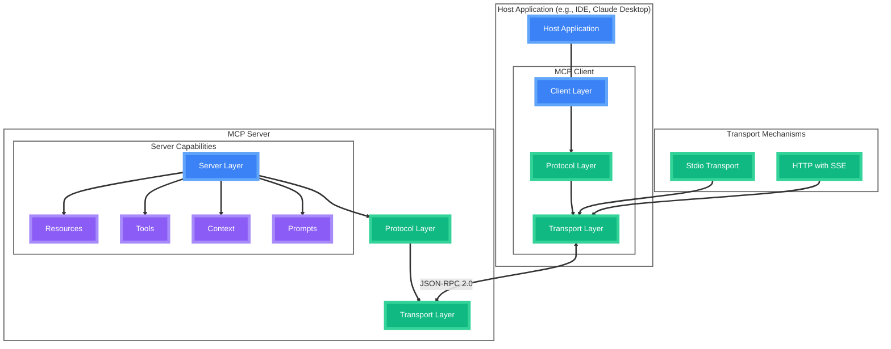

# Model Context Protocol

<!-- <div class="absolute top-1/2 left-1/2 transform -translate-x-1/2 -translate-y--50">
  <h2 class="text-6xl font-bold text-transparent bg-clip-text bg-gradient-to-r from-green-400 to-blue-500">
    Seamless AI Integration
  </h2>
</div> -->

<div class="abs-br m-6 flex gap-2">
  <a href="https://modelcontextprotocol.io" target="_blank" alt="MCP Website"
    class="text-xl icon-btn opacity-50 !border-none !hover:text-white">
    <i-carbon-logo-github />
  </a>
</div>

<!--
Presenter note: Welcome slide with gradient text effect
-->


---
layout: image-right
image: 'https://images.unsplash.com/photo-1551288049-bebda4e38f71?q=80'
---

# The Challenge

<v-clicks>

<div class="flex items-center mb-6">
  <div class="mr-4 p-3 rounded-full bg-red-500 bg-opacity-20">
    <i-carbon-warning-alt class="text-2xl text-red-500"/>
  </div>
  <div class="flex-1">
    <div class="font-bold mb-1">Fragmented AI Landscape</div>
    <div class="text-sm opacity-80">Multiple AI providers, each with unique APIs, authentication methods, and data formats, making integration complex and time-consuming.</div>
  </div>
</div>

<div class="flex items-center mb-6">
  <div class="mr-4 p-3 rounded-full bg-orange-500 bg-opacity-20">
    <i-carbon-development class="text-2xl text-orange-500"/>
  </div>
  <div class="flex-1">
    <div class="font-bold mb-1">Complex Integration</div>
    <div class="text-sm opacity-80">Diverse tooling, context management, and unique response handling create development overhead for custom implementations.</div>
  </div>
</div>

<div class="flex items-center mb-6">
  <div class="mr-4 p-3 rounded-full bg-yellow-500 bg-opacity-20">
    <i-carbon-security class="text-2xl text-yellow-500"/>
  </div>
  <div class="flex-1">
    <div class="font-bold mb-1">Security Concerns</div>
    <div class="text-sm opacity-80">Data privacy, access control, and secure communication channels pose critical challenges when integrating AI capabilities.</div>
  </div>
</div>

</v-clicks>

<div class="mt-8 grid grid-cols-3 gap-4">
  <div v-click class="text-center p-4 rounded-lg bg-red-500 bg-opacity-10">
    <i-carbon-cloud-services class="text-3xl text-red-400 mb-2"/>
    <div class="text-sm opacity-80">Growing Number of AI Services</div>
  </div>
  <div v-click class="text-center p-4 rounded-lg bg-orange-500 bg-opacity-10">
    <i-carbon-time class="text-3xl text-orange-400 mb-2"/>
    <div class="text-sm opacity-80">Increasing application complexity</div>
  </div>
  <div v-click class="text-center p-4 rounded-lg bg-yellow-500 bg-opacity-10">
    <i-carbon-shield class="text-3xl text-yellow-400 mb-2"/>
    <div class="text-sm opacity-80">Development time and costs rise</div>
  </div>
</div>

---
layout: fact
---

<div class="text-center">
  <h1 class="text-8xl font-bold text-transparent bg-clip-text bg-gradient-to-r from-green-400 to-blue-500">
    The Solution
  </h1>
</div>

---
layout: intro
---

# What is MCP?

<div class="mt-4 flex items-center justify-center">
  <div class="relative w-60 h-60">
    <div class="absolute w-full h-full rounded-full bg-blue-500 opacity-20 animate-ping"></div>
    <div class="relative w-full h-full flex items-center justify-center">
      <div class="text-center">
        <div class="text-4xl font-bold mb-2">MCP</div>
        <div class="text-xl">Model Context Protocol</div>
      </div>
    </div>
  </div>
</div>

<div class="mt-8 grid grid-cols-3 gap-4">
  <div v-click class="relative group p-4 rounded-lg overflow-hidden transition-all duration-500 hover:scale-105">
    <div class="absolute inset-0 bg-gradient-to-br from-blue-500/30 to-blue-700/30 group-hover:opacity-100 transition-opacity"></div>
    <div class="relative z-10">
      <i-carbon-connection-signal class="text-4xl mb-3 text-blue-400"/>
      <div class="font-bold text-xl mb-2">Standardised Interface</div>
      <div class="text-sm opacity-80 leading-relaxed">Connect AI models to external data and tools with a unified protocol</div>
    </div>
  </div>
  <div v-click class="relative group p-4 rounded-lg overflow-hidden transition-all duration-500 hover:scale-105">
    <div class="absolute inset-0 bg-gradient-to-br from-green-500/30 to-green-700/30 group-hover:opacity-100 transition-opacity"></div>
    <div class="relative z-10">
      <i-carbon-security class="text-4xl mb-3 text-green-400"/>
      <div class="font-bold text-xl mb-2">Secure by Design</div>
      <div class="text-sm opacity-80 leading-relaxed">Best practices for securing your data within your infrastructure</div>
    </div>
  </div>
  <div v-click class="relative group p-4 rounded-lg overflow-hidden transition-all duration-500 hover:scale-105">
    <div class="absolute inset-0 bg-gradient-to-br from-purple-500/30 to-purple-700/30 group-hover:opacity-100 transition-opacity"></div>
    <div class="relative z-10">
      <i-carbon-workflow class="text-4xl mb-3 text-purple-400"/>
      <div class="font-bold text-xl mb-2">Advanced Workflows</div>
      <div class="text-sm opacity-80 leading-relaxed">Helps you build agents and complex workflows on top of LLMs</div>
    </div>
  </div>
</div>

---
layout: default
---

# Core Architecture

<div class="mt-15 h-[200px] flex items-center justify-center">



</div>

<div class="mt-20 grid grid-cols-3 gap-4">
  <div v-click class="relative group p-4 rounded-lg overflow-hidden transition-all duration-500 hover:scale-105">
    <div class="absolute inset-0 bg-gradient-to-br from-blue-500/30 to-blue-700/30 group-hover:opacity-100 transition-opacity"></div>
    <div class="relative z-10">
      <i-carbon-application-web class="text-3xl mb-2 text-blue-400"/>
      <div class="font-bold">Host Layer</div>
      <div class="text-sm opacity-80">LLM Applications that want to access data through MCP</div>
    </div>
  </div>
  <div v-click class="relative group p-4 rounded-lg overflow-hidden transition-all duration-500 hover:scale-105">
    <div class="absolute inset-0 bg-gradient-to-br from-green-500/30 to-green-700/30 group-hover:opacity-100 transition-opacity"></div>
    <div class="relative z-10">
      <i-carbon-connect class="text-3xl mb-2 text-green-400"/>
      <div class="font-bold">Client Layer</div>
      <div class="text-sm opacity-80">Maintains and manages 1:1 connections to MCP Servers</div>
    </div>
  </div>
  <div v-click class="relative group p-4 rounded-lg overflow-hidden transition-all duration-500 hover:scale-105">
    <div class="absolute inset-0 bg-gradient-to-br from-purple-500/30 to-purple-700/30 group-hover:opacity-100 transition-opacity"></div>
    <div class="relative z-10">
      <i-carbon-machine-learning-model class="text-3xl mb-2 text-purple-400"/>
      <div class="font-bold">Server Layer</div>
      <div class="text-sm opacity-80">Provides data, tools and prompts to Clients</div>
    </div>
  </div>
</div>

---
layout: default
---

# Key Components

<div class="grid grid-cols-2 gap-8">
  <div v-click class="relative group">
    <div class="absolute -inset-0.5 bg-gradient-to-r from-blue-500 to-green-500 rounded-lg blur opacity-30 group-hover:opacity-100 transition duration-1000"></div>
    <div class="relative p-6 bg-black rounded-lg">
      <h3 class="text-xl font-bold mb-4">Protocol Layer</h3>
      <div class="space-y-2 text-sm">
        <div class="flex items-center">
          <i-carbon-code class="mr-2"/> Message Framing
        </div>
        <div class="flex items-center">
          <i-carbon-connect class="mr-2"/> Request/Response
        </div>
        <div class="flex items-center">
          <i-carbon-flow class="mr-2"/> Communication
        </div>
      </div>
    </div>
  </div>

  <div v-click class="relative group">
    <div class="absolute -inset-0.5 bg-gradient-to-r from-purple-500 to-pink-500 rounded-lg blur opacity-30 group-hover:opacity-100 transition duration-1000"></div>
    <div class="relative p-6 bg-black rounded-lg">
      <h3 class="text-xl font-bold mb-4">Transport Layer</h3>
      <div class="space-y-2 text-sm">
        <div class="flex items-center">
          <i-carbon-terminal class="mr-2"/> Stdio Transport
        </div>
        <div class="flex items-center">
          <i-carbon-http class="mr-2"/> HTTP with SSE
        </div>
        <div class="flex items-center">
          <i-carbon-json class="mr-2"/> JSON-RPC 2.0
        </div>
      </div>
    </div>
  </div>
</div>

<div v-click class="mt-8">
  <div class="relative group">
    <div class="absolute -inset-0.5 bg-gradient-to-r from-yellow-500 to-red-500 rounded-lg blur opacity-30 group-hover:opacity-100 transition duration-1000"></div>
    <div class="relative p-6 bg-black rounded-lg">
      <h3 class="text-xl font-bold mb-4">Message Types</h3>
      <div class="grid grid-cols-4 gap-4 text-sm">
        <div class="text-center">
          <i-carbon-send class="text-2xl mb-2 mx-auto"/> Requests
        </div>
        <div class="text-center">
          <i-carbon-checkmark class="text-2xl mb-2 mx-auto"/> Results
        </div>
        <div class="text-center">
          <i-carbon-warning class="text-2xl mb-2 mx-auto"/> Errors
        </div>
        <div class="text-center">
          <i-carbon-notification class="text-2xl mb-2 mx-auto"/> Notifications
        </div>
      </div>
    </div>
  </div>
</div>

---
layout: image
image: 'https://images.unsplash.com/photo-1551434678-e076c223a692?q=80'
class: 'text-white'
---

<div class="absolute inset-0 bg-black bg-opacity-60"></div>

<div class="relative z-10">
  <h1>Implementation Example</h1>

  ```typescript {all|2-3|4-8|10-19|all} {maxHeight: '400px'}
  import { Server } from "@modelcontextprotocol/sdk/server/index.js";
  import { StdioServerTransport } from "@modelcontextprotocol/sdk/server/stdio.js";

  const server = new Server({
    name: "example-server",
    version: "1.0.0"
  }, {
    capabilities: { resources: {} }
  });

  // Handle requests
  server.setRequestHandler(ListResourcesRequestSchema, async () => {
    return {
      resources: [
        {
          uri: "example://resource",
          name: "Example Resource"
        }
      ]
    };
  });

  // Connect transport
  const transport = new StdioServerTransport();
  await server.connect(transport);
  ```
</div>

---
layout: default
---

# Advanced Features

<div class="grid grid-cols-2 gap-8 h-full">
  <div class="space-y-8">
    <div v-click class="transform transition-all hover:scale-105">
      <div class="p-4 rounded-lg bg-gradient-to-r from-blue-500 to-blue-700">
        <h3 class="text-xl font-bold mb-2">Extensibility</h3>
        <ul class="space-y-2 text-sm">
          <li class="flex items-center">
            <i-carbon-plug class="mr-2"/> Custom Handlers
          </li>
          <li class="flex items-center">
            <i-carbon-assembly class="mr-2"/> Plugin Architecture
          </li>
        </ul>
      </div>
    </div>

    <div v-click class="transform transition-all hover:scale-105">
      <div class="p-4 rounded-lg bg-gradient-to-r from-green-500 to-green-700">
        <h3 class="text-xl font-bold mb-2">Performance</h3>
        <ul class="space-y-2 text-sm">
          <li class="flex items-center">
            <i-carbon-cache class="mr-2"/> Caching Strategies
          </li>
          <li class="flex items-center">
            <i-carbon-optimize class="mr-2"/> Context Optimization
          </li>
        </ul>
      </div>
    </div>
  </div>

  <div class="space-y-8">
    <div v-click class="transform transition-all hover:scale-105">
      <div class="p-4 rounded-lg bg-gradient-to-r from-purple-500 to-purple-700">
        <h3 class="text-xl font-bold mb-2">Security</h3>
        <ul class="space-y-2 text-sm">
          <li class="flex items-center">
            <i-carbon-security class="mr-2"/> Authentication
          </li>
          <li class="flex items-center">
            <i-carbon-encryption class="mr-2"/> Data Encryption
          </li>
        </ul>
      </div>
    </div>

    <div v-click class="transform transition-all hover:scale-105">
      <div class="p-4 rounded-lg bg-gradient-to-r from-red-500 to-red-700">
        <h3 class="text-xl font-bold mb-2">Monitoring</h3>
        <ul class="space-y-2 text-sm">
          <li class="flex items-center">
            <i-carbon-chart-line class="mr-2"/> Performance Metrics
          </li>
          <li class="flex items-center">
            <i-carbon-analytics class="mr-2"/> Usage Analytics
          </li>
        </ul>
      </div>
    </div>
  </div>
</div>

---
layout: image-right
image: 'https://images.unsplash.com/photo-1516116216624-53e697fedbea?q=80'
---

# Implementation Guide

<v-clicks>

<div class="flex items-center p-2 mb-4 rounded-lg bg-opacity-10 bg-white transform transition-all hover:scale-105">
  <div class="p-2 rounded-full bg-blue-500 mr-4">
    <i-carbon-package class="text-2xl"/>
  </div>
  <div>
    <div class="font-bold">Setup</div>
    <div class="text-sm opacity-80">Dependencies & Configuration</div>
  </div>
</div>

<div class="flex items-center p-2 mb-4 rounded-lg bg-opacity-10 bg-white transform transition-all hover:scale-105">
  <div class="p-2 rounded-full bg-green-500 mr-4">
    <i-carbon-development class="text-2xl"/>
  </div>
  <div>
    <div class="font-bold">Development</div>
    <div class="text-sm opacity-80">Handlers & Context</div>
  </div>
</div>

<div class="flex items-center p-2 mb-4 rounded-lg bg-opacity-10 bg-white transform transition-all hover:scale-105">
  <div class="p-2 rounded-full bg-purple-500 mr-4">
    <i-carbon-test class="text-2xl"/>
  </div>
  <div>
    <div class="font-bold">Testing</div>
    <div class="text-sm opacity-80">Validation & Security</div>
  </div>
</div>

<div class="flex items-center p-2 rounded-lg bg-opacity-10 bg-white transform transition-all hover:scale-105">
  <div class="p-2 rounded-full bg-red-500 mr-4">
    <i-carbon-deploy class="text-2xl"/>
  </div>
  <div>
    <div class="font-bold">Deployment</div>
    <div class="text-sm opacity-80">Environment & Monitoring</div>
  </div>
</div>

</v-clicks>

---
layout: fact
---

<div class="text-center">
  <h1 class="text-6xl font-bold mb-8">Best Practices</h1>
  
  <div class="grid grid-cols-2 gap-12">
    <div v-click class="transform transition-all hover:scale-105">
      <div class="text-green-400 text-4xl mb-4">
        <i-carbon-checkmark-outline />
      </div>
      <div class="text-2xl font-bold mb-2">Do's</div>
      <ul class="text-left space-y-2">
        <li class="flex items-center">
          <i-carbon-checkmark class="mr-2 text-green-400"/> Type-safe schemas
        </li>
        <li class="flex items-center">
          <i-carbon-checkmark class="mr-2 text-green-400"/> Error handling
        </li>
        <li class="flex items-center">
          <i-carbon-checkmark class="mr-2 text-green-400"/> Documentation
        </li>
      </ul>
    </div>

    <div v-click class="transform transition-all hover:scale-105">
      <div class="text-red-400 text-4xl mb-4">
        <i-carbon-close-outline />
      </div>
      <div class="text-2xl font-bold mb-2">Don'ts</div>
      <ul class="text-left space-y-2">
        <li class="flex items-center">
          <i-carbon-close class="mr-2 text-red-400"/> Skip validation
        </li>
        <li class="flex items-center">
          <i-carbon-close class="mr-2 text-red-400"/> Ignore errors
        </li>
        <li class="flex items-center">
          <i-carbon-close class="mr-2 text-red-400"/> Hardcode credentials
        </li>
      </ul>
    </div>
  </div>
</div>

---
layout: center
class: "text-center"
---

<div class="relative">
  <div class="absolute -inset-0.5 bg-gradient-to-r from-blue-500 to-green-500 rounded-lg blur opacity-30"></div>
  <div class="relative bg-black rounded-lg p-8">
    <h1 class="text-6xl font-bold mb-8">Thank You!</h1>
    
    <div class="flex justify-center space-x-8">
      <a href="https://modelcontextprotocol.io" target="_blank" 
        class="flex items-center px-4 py-2 rounded-lg bg-white bg-opacity-10 hover:bg-opacity-20 transition-all">
        <i-carbon-document class="mr-2"/> Documentation
      </a>
      <a href="https://github.com/your-repo" target="_blank"
        class="flex items-center px-4 py-2 rounded-lg bg-white bg-opacity-10 hover:bg-opacity-20 transition-all">
        <i-carbon-logo-github class="mr-2"/> GitHub
      </a>
      <a href="https://your-community-link" target="_blank"
        class="flex items-center px-4 py-2 rounded-lg bg-white bg-opacity-10 hover:bg-opacity-20 transition-all">
        <i-carbon-group class="mr-2"/> Community
      </a>
    </div>
  </div>
</div> 