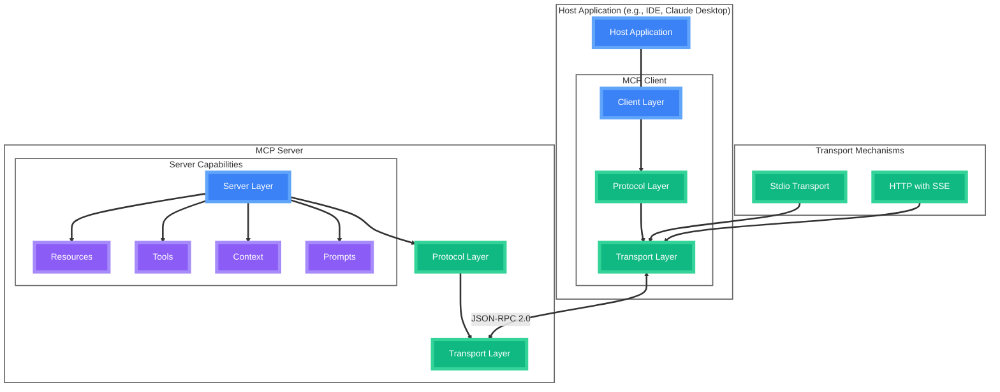

# Model Context Protocol

<div class="abs-br m-6 flex gap-2">
  <a href="https://modelcontextprotocol.io" target="_blank" alt="MCP Website"
    class="text-xl icon-btn opacity-50 !border-none !hover:text-white">
    <i-carbon-logo-github />
  </a>
</div>

<!--
- Intro who I am
- Have the best job - get to play with AI
- making apps with AI
- Phil and I feel MCP going to be more influential in the AI ecosystem than people realise
- Want to show you a bit of what we’re seeing
-->

---
layout: image-right
image: 'diagrams/AI_Landscape.jpg'
---

# The Integration Issue

<v-clicks>

<div class="flex items-center mb-6">
  <div class="mr-4 p-3 rounded-full bg-red-500 bg-opacity-20">
    <i-carbon-warning-alt class="text-2xl text-red-500"/>
  </div>
  <div class="flex-1">
    <div class="font-bold mb-1">Fragmented AI Landscape</div>
    <div class="text-sm opacity-80">Multiple AI providers, each with unique APIs, authentication methods, and data formats, making integration complex and time-consuming.</div>
  </div>
</div>

<div class="flex items-center mb-6">
  <div class="mr-4 p-3 rounded-full bg-orange-500 bg-opacity-20">
    <i-carbon-development class="text-2xl text-orange-500"/>
  </div>
  <div class="flex-1">
    <div class="font-bold mb-1">Complex Integration</div>
    <div class="text-sm opacity-80">Diverse tooling, context management, and unique response handling create development overhead for custom implementations.</div>
  </div>
</div>

<div class="flex items-center mb-6">
  <div class="mr-4 p-3 rounded-full bg-yellow-500 bg-opacity-20">
    <i-carbon-security class="text-2xl text-yellow-500"/>
  </div>
  <div class="flex-1">
    <div class="font-bold mb-1">Security Concerns</div>
    <div class="text-sm opacity-80">Data privacy, access control, and secure communication channels pose critical challenges when integrating AI capabilities.</div>
  </div>
</div>

</v-clicks>

<div class="mt-8 grid grid-cols-3 gap-4">
  <div v-click class="text-center p-4 rounded-lg bg-red-500 bg-opacity-10">
    <i-carbon-cloud-services class="text-3xl text-red-400 mb-2"/>
    <div class="text-sm opacity-80">Growing Number of AI Services</div>
  </div>
  <div v-click class="text-center p-4 rounded-lg bg-orange-500 bg-opacity-10">
    <i-carbon-time class="text-3xl text-orange-400 mb-2"/>
    <div class="text-sm opacity-80">Increasing application complexity</div>
  </div>
  <div v-click class="text-center p-4 rounded-lg bg-yellow-500 bg-opacity-10">
    <i-carbon-shield class="text-3xl text-yellow-400 mb-2"/>
    <div class="text-sm opacity-80">Development time and costs rise</div>
  </div>
</div>

<!--
- Big issue in gen AI
- How do we connect AI apps to external ones.
- Lots of providers, 
- More complex app needs, growing ambition and increased capabilities
- data protection
-->

---
layout: fact
---

<div class="text-center">
  <h1 class="text-8xl font-bold text-transparent bg-clip-text bg-gradient-to-r from-green-400 to-blue-500">
    Enter MCP
  </h1>
  <p class="mt-4 text-2xl opacity-80">Model Context Protocol</p>
  <p class="mt-2 text-xl opacity-60">The missing standard for AI integration</p>
  <div class="absolute bottom-10 left-0 right-0 flex items-center justify-center">
    <span class="mr-2 text-xl">by Anthropic</span>
    
  </div>
</div>

<!--
This is where Model Context Protocol, developed by anthropic comes in
-->

---
layout: default
transition: slide-up
---

# What is MCP?

<div 
  class="text-center transition-all duration-500 absolute left-1/2 transform -translate-x-1/2"
  :class="{ 'top-1/2 -translate-y-1/2': $slidev.nav.clicks === 0, 'top-24': $slidev.nav.clicks > 0 }"
>
  <p class="text-xl max-w-4xl w-[800px] font-bold text-gray-800">
    MCP is an open source protocol that enables the seamless integration AI apps and agents with tools and data sources
  </p>
</div>

<div 
  v-if="$slidev.nav.clicks > 0" 
  class="relative mt-28 p-6 rounded-lg overflow-hidden animate-fade-in"
>
  <div class="absolute inset-0 bg-gradient-to-br from-blue-500/20 to-purple-500/20 rounded-lg"></div>
  <div class="relative z-10">
    <div class="flex items-center justify-center mb-4">
      <div class="text-center">
        <i-carbon-api-1 class="text-5xl text-blue-400 inline-block"/>
        <i-carbon-arrow-right class="text-3xl text-gray-400 mx-2 inline-block"/>
        <i-carbon-application-web class="text-5xl text-green-400 inline-block"/>
        <p class="mt-2 font-bold text-lg">REST API in Web Development</p>
        <p class="text-sm opacity-80">Connects web applications to data and services</p>
      </div>
      <div class="mx-8 text-3xl opacity-30">=</div>
      <div class="text-center">
        <i-carbon-machine-learning-model class="text-5xl text-purple-400 inline-block"/>
        <i-carbon-arrow-right class="text-3xl text-gray-400 mx-2 inline-block"/>
        <i-carbon-tool-kit class="text-5xl text-pink-400 inline-block"/>
        <p class="mt-2 font-bold text-lg">MCP in AI Ecosystem</p>
        <p class="text-sm opacity-80">Connects AI applications to tools and data</p>
      </div>
    </div>
    <!-- 
    Just as APIs provide a standardized way for web applications to interact with data services, MCP offers a uniform interface for LLMs and generative AI to access tools, context, and data sources - eliminating the need for custom integration with each AI provider.
    -->
  </div>
</div>

<div v-click class="mt-8 grid grid-cols-3 gap-4" :class="{ 'opacity-0': $slidev.nav.clicks < 1, 'opacity-100 transition-opacity duration-500 delay-300': $slidev.nav.clicks >= 1 }">
  <div class="relative group p-4 rounded-lg overflow-hidden transition-all duration-500 hover:scale-105">
    <div class="absolute inset-0 bg-gradient-to-br from-blue-500/30 to-blue-700/30 group-hover:opacity-100 transition-opacity"></div>
    <div class="relative z-10">
      <i-carbon-api class="text-4xl mb-3 text-blue-400"/>
      <div class="font-bold text-xl mb-2">Open Standard</div>
      <div class="text-sm opacity-80 leading-relaxed">An open protocol designed for community adoption and extension</div>
    </div>
  </div>
  
  <div class="relative group p-4 rounded-lg overflow-hidden transition-all duration-500 hover:scale-105">
    <div class="absolute inset-0 bg-gradient-to-br from-green-500/30 to-green-700/30 group-hover:opacity-100 transition-opacity"></div>
    <div class="relative z-10">
      <i-carbon-tool-kit class="text-4xl mb-3 text-green-400"/>
      <div class="font-bold text-xl mb-2">Tool Integration</div>
      <div class="text-sm opacity-80 leading-relaxed">Securely connect AI with your application's tools and capabilities</div>
    </div>
  </div>
  
  <div class="relative group p-4 rounded-lg overflow-hidden transition-all duration-500 hover:scale-105">
    <div class="absolute inset-0 bg-gradient-to-br from-purple-500/30 to-purple-700/30 group-hover:opacity-100 transition-opacity"></div>
    <div class="relative z-10">
      <i-carbon-data-enrichment class="text-4xl mb-3 text-purple-400"/>
      <div class="font-bold text-xl mb-2">Data Access</div>
      <div class="text-sm opacity-80 leading-relaxed">Controlled access to application resources and contextual data</div>
    </div>
  </div>
</div>

<style>
.animate-fade-in {
  animation: fadeIn 0.8s ease-out forwards;
}

@keyframes fadeIn {
  from {
    opacity: 0;
    transform: translateY(20px);
  }
  to {
    opacity: 1;
    transform: translateY(0);
  }
}
</style>

<!--
- What does MCP Do?
- MCP connects AI apps and agents, to tools and data sources
- Is is for AI what REST API was for Web dev
- Can also think like USB-C
-->

---
layout: image-right
image: 'servers_screenshot.png'
---

# Growing MCP Support

<div class="flex flex-col gap-4 pr-0">
  <div class="relative group">
    <div class="absolute -inset-0.5 bg-gradient-to-r from-blue-500 to-indigo-500 rounded-lg blur opacity-30 group-hover:opacity-100 transition duration-1000"></div>
    <div class="relative p-5 bg-gray-900 rounded-lg border border-blue-500/30">
      <div class="flex items-center mb-4">
        <i-carbon-repository class="text-4xl text-blue-400 mr-3"/>
        <div>
          <div class="font-bold text-lg text-blue-300">Official MCP Servers Repository</div>
          <div class="text-sm text-gray-300">11.4k+ stars · 1.2k+ forks · 200+ contributors</div>
        </div>
      </div>
      <p class="text-gray-200 text-sm mb-4">Collection of reference MCP servers.</p>
      <div class="grid grid-cols-3 gap-2">
        <div class="bg-gray-800 rounded px-3 py-2 text-gray-300 text-xs">
          <i-carbon-document class="mr-1 text-blue-400"/> GitHub
        </div>
        <div class="bg-gray-800 rounded px-3 py-2 text-gray-300 text-xs">
          <i-carbon-delivery class="mr-1 text-green-400"/> Jira
        </div>
        <div class="bg-gray-800 rounded px-3 py-2 text-gray-300 text-xs">
          <i-carbon-shopping-catalog class="mr-1 text-yellow-400"/> PostgreSQL
        </div>
        <div class="bg-gray-800 rounded px-3 py-2 text-gray-300 text-xs">
          <i-carbon-cloud class="mr-1 text-purple-400"/> Weather
        </div>
        <div class="bg-gray-800 rounded px-3 py-2 text-gray-300 text-xs">
          <i-carbon-search class="mr-1 text-red-400"/> Google
        </div>
        <div class="bg-gray-800 rounded px-3 py-2 text-gray-300 text-xs">
          <i-carbon-folder class="mr-1 text-orange-400"/> FileSystem
        </div>
      </div>
    </div>
  </div>

  <div class="relative group">
    <div class="absolute -inset-0.5 bg-gradient-to-r from-green-500 to-teal-500 rounded-lg blur opacity-30 group-hover:opacity-100 transition duration-1000"></div>
    <div class="relative p-5 bg-gray-900 rounded-lg border border-green-500/30">
      <div class="flex items-center mb-4">
        <i-carbon-connect class="text-4xl text-green-400 mr-3"/>
        <div>
          <div class="font-bold text-lg text-green-300">Community-Created Servers</div>
          <div class="text-sm text-gray-300">500+ servers in the awesome-mcp-servers list</div>
        </div>
      </div>
      <div class="grid grid-cols-2 gap-3">
        <div class="flex items-start p-2 bg-gray-800 rounded">
          <i-carbon-diagram class="text-teal-400 mt-1 mr-2 flex-shrink-0"/>
          <div>
            <div class="text-sm text-gray-300">JetBrains</div>
          </div>
        </div>
        <div class="flex items-start p-2 bg-gray-800 rounded">
          <i-carbon-network-3 class="text-blue-400 mt-1 mr-2 flex-shrink-0"/>
          <div>
            <div class="text-sm text-gray-300">Bluesky</div>
          </div>
        </div>
        <div class="flex items-start p-2 bg-gray-800 rounded">
          <i-carbon-currency-bitcoin class="text-yellow-400 mt-1 mr-2 flex-shrink-0"/>
          <div>
            <div class="text-sm text-gray-300">Binance</div>
          </div>
        </div>
        <div class="flex items-start p-2 bg-gray-800 rounded">
          <i-carbon-document-pdf class="text-red-400 mt-1 mr-2 flex-shrink-0"/>
          <div>
            <div class="text-sm text-gray-300">Box</div>
          </div>
        </div>
      </div>
    </div>
  </div>
</div>

<!-- 
Right side placeholder:
In the layout: image-right format, you need to replace the image: '#' with the actual screenshot URL.
Example: image: 'path/to/mcp-servers-screenshot.png'
-->

<!--
- People are taking notice
- Large collection of official integrations with large platforms
- Constant growing eco system of comunity made servers such as:
-->

---
layout: default
---

# MCP Flow in Composio

<div class="absolute inset-0 mt-20 z-0 flex items-center justify-center overflow-hidden">
  
</div>

<!-- Replace the simple card with dynamic, visually engaging elements -->
<div v-click class="absolute top-32 left-1/2 transform -translate-x-1/2 z-10 hover:rotate-0 transition-all duration-500">
  <div class="relative group">
    <div class="absolute -inset-1 bg-gradient-to-r from-blue-500 to-blue-600 rounded-lg blur opacity-60 group-hover:opacity-100 transition duration-500"></div>
    <div class="relative p-5 bg-white/10 backdrop-blur-sm rounded-lg shadow-xl border border-blue-500/30">
      <div class="flex items-center">
        <i-carbon-logo-react class="text-3xl text-blue-400 mr-3 animate-pulse"/>
        <div>
          <div class="font-bold text-white text-center">Composio</div>
          <div class="text-sm text-blue-200 text-center">Real products are starting to emerge, leveraging mcp</div>
        </div>
      </div>
    </div>
  </div>
</div>

<!--
- Example of Apps getting made using MCP
-->

---
layout: center
class: "text-center"
---

# What Can an MCP do?

<div class="flex items-center justify-center w-full h-full mt-[-20px]">
  
</div>

---
layout: fact
clicks: 1
---

<style>
.grow-and-center {
  position: relative;
  display: inline-block;
}

.grow-and-center.active {
  animation: growAndCenter 1.5s forwards;
  text-transform: capitalize;
  position: absolute;
}

.fade-out {
  transition: opacity 0.5s, visibility 0s 0.5s;
}

.fade-out.active {
  opacity: 0;
  visibility: hidden;
}

@keyframes growAndCenter {
  0% {
    font-size: 5rem;
    left: 20%;
    transform: translateX(0);
  }
  50% {
    font-size: 8rem;
    left: 20%;
    transform: translateX(0);
  }
  100% {
    font-size: 8rem;
    left: 48%;
    transform: translateX(-50%);
  }
}
</style>

<div class="flex items-center justify-center h-full relative">
  <div class="flex items-center text-center">
    <span 
      class="text-5xl font-bold fade-out"
      :class="{ 'active': $slidev.nav.clicks > 0 }"
    >
      How
    </span>
    <span 
      class="text-5xl font-bold grow-and-center mx-4 text-transparent bg-clip-text bg-gradient-to-r from-green-400 to-blue-500"
      :class="{ 'active': $slidev.nav.clicks > 0 }"
    >
      easy
    </span>
    <span 
      class="text-5xl font-bold fade-out"
      :class="{ 'active': $slidev.nav.clicks > 0 }"
    >
      are MCPs to set up?
    </span>
  </div>
</div>

<!--
- If you want to start using MCP how hard is it to get it set up?
EASY
-->

---
layout: center
class: "text-center"
transition: slide-up
---

# Setting Up an MCP Server in Claude Desktop


<div class="flex justify-center items-center mt-4">
  <div class="relative w-[800px] h-[450px] bg-gray-900 rounded-lg overflow-hidden border-2 border-gray-700 flex items-center justify-center">
    <!-- Video will be embedded here once recorded -->
    <div class="text-center">
      <i-carbon-play-filled class="text-6xl text-gray-600 mb-4"/>
    </div>
    <video 
      controls
      class="w-full h-full object-cover">
      <source src="/diagrams/MCP_setup.mp4" type="video/mp4">
      Your browser does not support the video tag.
    </video>
  </div>
</div>

<!--
Brave search example:
- I hate that Claude desktop can't connect to the web. I can solve this in minutes. 

Joke about me deleting the api key
-->

---
layout: center
class: "text-center"
---

# MCPs are not just for Claude

<div class="flex justify-center items-center mt-4">
  <div class="relative w-[800px] h-[450px] flex items-center justify-center">
    
  </div>
</div>

<!--
That was for Claude desktop, but there are much more uses.

- Discuss architecture overview.
- At IDE mention Cursor - this is mega
- Think browser logs, no more having to copy and paste back and forth.
- Think Postgres, increased visibility for AI means better code and faster debug.
-->

---
layout: default
---

# Core Architecture

<div class="mt-15 h-[200px] flex items-center justify-center">



</div>

<div class="mt-20 grid grid-cols-3 gap-4">
  <div v-click class="relative group p-4 rounded-lg overflow-hidden transition-all duration-500 hover:scale-105">
    <div class="absolute inset-0 bg-gradient-to-br from-blue-500/30 to-blue-700/30 group-hover:opacity-100 transition-opacity"></div>
    <div class="relative z-10">
      <i-carbon-application-web class="text-3xl mb-2 text-blue-400"/>
      <div class="font-bold">Host Layer</div>
      <div class="text-sm opacity-80">LLM Applications that want to access data through MCP</div>
    </div>
  </div>
  <div v-click class="relative group p-4 rounded-lg overflow-hidden transition-all duration-500 hover:scale-105">
    <div class="absolute inset-0 bg-gradient-to-br from-green-500/30 to-green-700/30 group-hover:opacity-100 transition-opacity"></div>
    <div class="relative z-10">
      <i-carbon-connect class="text-3xl mb-2 text-green-400"/>
      <div class="font-bold">Client Layer</div>
      <div class="text-sm opacity-80">Maintains and manages 1:1 connections to MCP Servers</div>
    </div>
  </div>
  <div v-click class="relative group p-4 rounded-lg overflow-hidden transition-all duration-500 hover:scale-105">
    <div class="absolute inset-0 bg-gradient-to-br from-purple-500/30 to-purple-700/30 group-hover:opacity-100 transition-opacity"></div>
    <div class="relative z-10">
      <i-carbon-machine-learning-model class="text-3xl mb-2 text-purple-400"/>
      <div class="font-bold">Server Layer</div>
      <div class="text-sm opacity-80">Provides data, tools and prompts to Clients</div>
    </div>
  </div>
</div>

---
layout: default
transition: slide-up
---

# MCP Client is not just an Interface

<div class="mt-0 text-left">
  <h3 class="text-lg text-gray-800">
    It is a Fully Featured Middleware
  </h3>
</div>

<div v-click class="relative group mt-8">
  <div class="absolute -inset-0.5 bg-gradient-to-r from-blue-500 to-indigo-500 rounded-lg blur opacity-30 group-hover:opacity-100 transition duration-1000"></div>
  <div class="relative p-4 bg-gray-900 rounded-lg border border-blue-500/30">
    <div class="flex items-center justify-between">
      <div class="w-1/3">
        <div class="text-center">
          <i-carbon-application class="text-5xl text-blue-400 inline-block"/>
          <i-carbon-arrow-right class="text-2xl text-gray-400 mx-2 inline-block"/>
          <i-carbon-machine-learning-model class="text-5xl text-green-400 inline-block"/>
          <p class="mt-2 text-sm text-gray-300">Host App → LLM</p>
        </div>
      </div>
      <div class="w-1/3 text-center">
        <div class="font-bold text-xl mb-2 text-blue-400">MCP Client</div>
        <div class="bg-gradient-to-r from-blue-500/20 to-purple-500/20 rounded-lg p-3 text-sm text-gray-200">
          Full-featured middleware that orchestrates communication, manages context, executes tools, and maintains session state
        </div>
      </div>
      <div class="w-1/3">
        <div class="text-center">
          <i-carbon-machine-learning-model class="text-5xl text-green-400 inline-block"/>
          <i-carbon-arrow-right class="text-2xl text-gray-400 mx-2 inline-block"/>
          <i-carbon-tool-kit class="text-5xl text-purple-400 inline-block"/>
          <p class="mt-2 text-sm text-gray-300">LLM → MCP Servers</p>
        </div>
      </div>
    </div>
  </div>
</div>

<div class="grid grid-cols-5 gap-3 mt-8">
  <div v-click class="relative group">
    <div class="absolute -inset-0.5 bg-gradient-to-r from-blue-500 to-cyan-500 rounded-lg blur opacity-30 group-hover:opacity-100 transition duration-1000"></div>
    <div class="relative p-3 bg-gray-900 rounded-lg border border-blue-500/30 h-full">
      <div class="text-center">
        <i-carbon-application-web class="text-3xl mb-2 mx-auto text-blue-400"/>
        <div class="font-bold text-sm text-blue-200">Initialization</div>
      </div>
      <div class="mt-2 space-y-1">
        <div class="bg-gray-800 rounded px-2 py-1 text-gray-300 text-xs">Session lifecycle</div>
        <div class="bg-gray-800 rounded px-2 py-1 text-gray-300 text-xs">API configuration</div>
        <div class="bg-gray-800 rounded px-2 py-1 text-gray-300 text-xs">Resource management</div>
      </div>
    </div>
  </div>

  <div v-click class="relative group">
    <div class="absolute -inset-0.5 bg-gradient-to-r from-green-500 to-emerald-500 rounded-lg blur opacity-30 group-hover:opacity-100 transition duration-1000"></div>
    <div class="relative p-3 bg-gray-900 rounded-lg border border-green-500/30 h-full">
      <div class="text-center">
        <i-carbon-connect class="text-3xl mb-2 mx-auto text-green-400"/>
        <div class="font-bold text-sm text-green-200">Server Connections</div>
      </div>
      <div class="mt-2 space-y-1">
        <div class="bg-gray-800 rounded px-2 py-1 text-gray-300 text-xs">Multiple server types</div>
        <div class="bg-gray-800 rounded px-2 py-1 text-gray-300 text-xs">Compatibility checks</div>
        <div class="bg-gray-800 rounded px-2 py-1 text-gray-300 text-xs">Communication channels</div>
      </div>
    </div>
  </div>

  <div v-click class="relative group">
    <div class="absolute -inset-0.5 bg-gradient-to-r from-purple-500 to-violet-500 rounded-lg blur opacity-30 group-hover:opacity-100 transition duration-1000"></div>
    <div class="relative p-3 bg-gray-900 rounded-lg border border-purple-500/30 h-full">
      <div class="text-center">
        <i-carbon-data-refinery class="text-3xl mb-2 mx-auto text-purple-400"/>
        <div class="font-bold text-sm text-purple-200">Query Processing</div>
      </div>
      <div class="mt-2 space-y-1">
        <div class="bg-gray-800 rounded px-2 py-1 text-gray-300 text-xs">Conversation context</div>
        <div class="bg-gray-800 rounded px-2 py-1 text-gray-300 text-xs">Response handling</div>
        <div class="bg-gray-800 rounded px-2 py-1 text-gray-300 text-xs">Tool call execution</div>
      </div>
    </div>
  </div>

  <div v-click class="relative group">
    <div class="absolute -inset-0.5 bg-gradient-to-r from-yellow-500 to-amber-500 rounded-lg blur opacity-30 group-hover:opacity-100 transition duration-1000"></div>
    <div class="relative p-3 bg-gray-900 rounded-lg border border-yellow-500/30 h-full">
      <div class="text-center">
        <i-carbon-user-interface class="text-3xl mb-2 mx-auto text-yellow-400"/>
        <div class="font-bold text-sm text-yellow-200">Interface Management</div>
      </div>
      <div class="mt-2 space-y-1">
        <div class="bg-gray-800 rounded px-2 py-1 text-gray-300 text-xs">Command-line interface</div>
        <div class="bg-gray-800 rounded px-2 py-1 text-gray-300 text-xs">Input/output handling</div>
        <div class="bg-gray-800 rounded px-2 py-1 text-gray-300 text-xs">Program flow control</div>
      </div>
    </div>
  </div>

  <div v-click class="relative group">
    <div class="absolute -inset-0.5 bg-gradient-to-r from-red-500 to-pink-500 rounded-lg blur opacity-30 group-hover:opacity-100 transition duration-1000"></div>
    <div class="relative p-3 bg-gray-900 rounded-lg border border-red-500/30 h-full">
      <div class="text-center">
        <i-carbon-recovery class="text-3xl mb-2 mx-auto text-red-400"/>
        <div class="font-bold text-sm text-red-200">Error Management</div>
      </div>
      <div class="mt-2 space-y-1">
        <div class="bg-gray-800 rounded px-2 py-1 text-gray-300 text-xs">Resource cleanup</div>
        <div class="bg-gray-800 rounded px-2 py-1 text-gray-300 text-xs">Connection issues</div>
        <div class="bg-gray-800 rounded px-2 py-1 text-gray-300 text-xs">Graceful shutdown</div>
      </div>
    </div>
  </div>
</div>

<!--
- The Client is what manages the conversations between the host app and the servers.
- It is much more than a simple message router though
- It orchestrates the entire Protocol
-->

---
layout: default
transition: slide-up
clicks: 1
---

# Server Key Components

<div 
  class="transition-all duration-500 ease-in-out"
  :class="{
    'mt-8': $slidev.nav.clicks > 0,
    'mt-28': $slidev.nav.clicks === 0
  }"
>
  <!-- Enhance top card with larger size and more prominent effects -->
  <div class="relative group transform transition-all duration-500 hover:scale-[1.01]">
    <div class="absolute -inset-0.5 bg-gradient-to-r from-yellow-500 to-red-500 rounded-lg blur opacity-40 group-hover:opacity-100 group-hover:blur-md transition duration-1000"></div>
    <div class="relative p-6 bg-gray-900 rounded-lg border-2 border-yellow-500/40 shadow-xl">
      <div class="grid grid-cols-3 gap-0 text-sm">
        <div class="text-center border-r border-gray-700 pr-4">
          <div class="mb-1 text-gray-400 text-[10px] uppercase tracking-wide">Model Controlled</div>
          <i-carbon-tool-kit class="text-4xl mb-2 mx-auto text-yellow-400"/> 
          <div class="text-gray-200 font-semibold text-lg">Tools</div>
          <div class="text-xs text-gray-400">Functions invoked by the model</div>
          <div class="mt-3 space-y-1">
            <div class="bg-gray-800 rounded px-3 py-1 text-gray-300">Retrieve / search</div>
            <div class="bg-gray-800 rounded px-3 py-1 text-gray-300">Send a message</div>
            <div class="bg-gray-800 rounded px-3 py-1 text-gray-300">Update DB records</div>
          </div>
        </div>
        <div class="text-center border-r border-gray-700 px-4">
          <div class="mb-1 text-gray-400 text-[10px] uppercase tracking-wide">Application Controlled</div>
          <i-carbon-document class="text-4xl mb-2 mx-auto text-yellow-400"/> 
          <div class="text-gray-200 font-semibold text-lg">Resources</div>
          <div class="text-xs text-gray-400">Data exposed to the application</div>
          <div class="mt-3 space-y-1">
            <div class="bg-gray-800 rounded px-3 py-1 text-gray-300">Files</div>
            <div class="bg-gray-800 rounded px-3 py-1 text-gray-300">Database Records</div>
            <div class="bg-gray-800 rounded px-3 py-1 text-gray-300">API Responses</div>
          </div>
        </div>
        <div class="text-center pl-4">
          <div class="mb-1 text-gray-400 text-[10px] uppercase tracking-wide">User Controlled</div>
          <i-carbon-text-creation class="text-4xl mb-2 mx-auto text-yellow-400"/> 
          <div class="text-gray-200 font-semibold text-lg">Prompts</div>
          <div class="text-xs text-gray-400">Pre-defined templates for AI interactions</div>
          <div class="mt-3 space-y-1">
            <div class="bg-gray-800 rounded px-3 py-1 text-gray-300">Document Q&A</div>
            <div class="bg-gray-800 rounded px-3 py-1 text-gray-300">Transcript Summary</div>
            <div class="bg-gray-800 rounded px-3 py-1 text-gray-300">Workflow Automation</div>
          </div>
        </div>
      </div>
    </div>
  </div>
</div>

<!-- Reduce size and visual impact of lower cards -->
<div 
  class="mt-6 grid grid-cols-2 gap-6 transition-opacity duration-500 scale-90 opacity-80"
  :class="{ 'opacity-0 invisible': $slidev.nav.clicks === 0, 'opacity-80 visible': $slidev.nav.clicks > 0 }"
>
  <div class="relative group">
    <div class="absolute -inset-0.5 bg-gradient-to-r from-blue-500 to-green-500 rounded-lg blur opacity-20 group-hover:opacity-40 transition duration-1000"></div>
    <div class="relative p-3 bg-gray-900/90 rounded-lg border border-blue-500/20">
      <h3 class="text-lg font-bold mb-3 text-blue-400">Protocol Layer</h3>
      <div class="space-y-1 text-xs">
        <div class="flex items-center text-gray-300">
          <i-carbon-data-share class="mr-2 text-blue-400"/> Message Framing & Routing
        </div>
        <div class="flex items-center text-gray-300">
          <i-carbon-connect class="mr-2 text-blue-400"/> Request/Response Management
        </div>
        <div class="flex items-center text-gray-300">
          <i-carbon-flow class="mr-2 text-blue-400"/> Communication Patterns
        </div>
        <div class="flex items-center text-gray-300">
          <i-carbon-certificate class="mr-2 text-blue-400"/> Versioned Protocol Schemas
        </div>
      </div>
    </div>
  </div>

  <div class="relative group">
    <div class="absolute -inset-0.5 bg-gradient-to-r from-purple-500 to-pink-500 rounded-lg blur opacity-20 group-hover:opacity-40 transition duration-1000"></div>
    <div class="relative p-3 bg-gray-900/90 rounded-lg border border-purple-500/20">
      <h3 class="text-lg font-bold mb-3 text-purple-400">Transport Layer</h3>
      <div class="space-y-1 text-xs">
        <div class="flex items-center text-gray-300">
          <i-carbon-code class="mr-2 text-purple-400"/> JSON-RPC 2.0 Wire Format
        </div>
        <div class="flex items-center text-gray-300">
          <i-carbon-data-transformer class="mr-2 text-purple-400"/> Protocol Message Transmission
        </div>
        <div class="flex items-center text-gray-300">
          <i-carbon-terminal class="mr-2 text-purple-400"/> Multiple Transport Methods
        </div>
        <div class="flex items-center text-gray-300">
          <i-carbon-plug class="mr-2 text-purple-400"/> Extensible Channel System
        </div>
      </div>
    </div>
  </div>
</div>

<!--
- Servers are what most people think about
- Contains the tools and data we're trying to connect
- Most people think of tools but there is more
- 3 Main primitives for servers
- CONTROLL TYPES IMPORTANT!
- Prompts are very powerful and underutilised
- One thing thats great about mcp is it allows for determinism from AI
- Bring back to Prompts are very good for this
-->

---
layout: full
---

# MCP Flow

<div class="flex items-center justify-center w-full h-full mt-[-20px]">
  
</div>

---
layout: default
---

# Example MCP Flow

<div class="absolute inset-13 mt-10 z-0 flex items-center justify-right overflow-hidden">
  
</div>

<div class="absolute left-10 top-25 w-80 z-10 text-white">
  <div class="bg-black bg-opacity-70 p-3 rounded-lg border-l-4 border-blue-400">
      <li class="flex items-center">
        <div class="mr-3 p-1 rounded-full bg-blue-500 bg-opacity-30 flex-shrink-0">
          <i-carbon-arrow-right class="text-blue-400 text-sm"/>
        </div>
        <p class="text-sm">Claude determines which tools to call and when based on user questions and tool descriptions</p>
      </li>
      <li class="flex items-center">
        <div class="mr-3 p-1 rounded-full bg-green-500 bg-opacity-30 flex-shrink-0">
          <i-carbon-arrow-right class="text-green-400 text-sm"/>
        </div>
        <p class="text-sm">Tools don't call each other; they're independent capabilities invoked by the model</p>
      </li>
      <li class="flex items-center">
        <div class="mr-3 p-1 rounded-full bg-purple-500 bg-opacity-30 flex-shrink-0">
          <i-carbon-arrow-right class="text-purple-400 text-sm"/>
        </div>
        <p class="text-sm">Results from tools feed back to the model which are used to inform next steps in the workflow</p>
      </li>
      <li class="flex items-center">
        <div class="mr-3 p-1 rounded-full bg-yellow-500 bg-opacity-30 flex-shrink-0">
          <i-carbon-arrow-right class="text-yellow-400 text-sm"/>
        </div>
        <p class="text-sm">Claude decides how to provide results from tools to the user depending on context and result type</p>
      </li>
  </div>
</div>

---
layout: center
class: "text-center"
---

# MCP in Action: Demo

<div class="flex justify-center items-center mt-4">
  <div class="relative w-[800px] h-[450px] bg-gray-900 rounded-lg overflow-hidden border-2 border-gray-700 flex items-center justify-center">
    <video 
      controls
      class="w-full h-full object-cover">
      <source src="/diagrams/workbook_remap.mp4" type="video/mp4">
      Your browser does not support the video tag.
    </video>
  </div>
</div>

<!--
BEFORE PLAYING:
- Solving a problem you guys have
- Prompts prevent user issues - more reproducible work flows

- Talk through, stop video and show whats happening
-->

---
layout: fact
class: text-center
---

<div class="flex flex-col items-center justify-center h-full">
  <h1 class="text-2xl font-bold">
    <span class="text-gray-900">How to Build Your Own</span>
    <span class="text-transparent bg-clip-text bg-gradient-to-r from-blue-500 to-green-500"> Custom </span>
    <span class="text-gray-900">MCP Servers</span>
  </h1>
</div>

---
layout: two-cols
---

# Implementing MCP Tools

<div class="pr-6 h-full">
  <div class="relative group mb-4 h-[400px]">
    <div class="absolute -inset-0.5 bg-gradient-to-r from-blue-500 to-cyan-500 rounded-lg blur opacity-30 group-hover:opacity-100 transition duration-1000"></div>
    <div class="relative p-4 bg-gray-900 rounded-lg border border-blue-500/30 h-full flex flex-col">
      <h3 class="text-lg font-bold mb-2 text-blue-400">1. Define Tool Schema</h3>
      <div class="overflow-auto flex-1">
```python
@app.list_tools()
async def list_tools() -> list[types.Tool]:
    return [
        types.Tool(
            name="calculate_sum",
            description="Add two numbers together",
            inputSchema={
                "type": "object",
                "properties": {
                    "a": {"type": "number"},
                    "b": {"type": "number"}
                },
                "required": ["a", "b"]
            }
        )
    ]
```
      </div>
    </div>
  </div>
</div>

::right::

<div class="h-full">
  <div class="relative group h-[400px] mt-[56px]">
    <div class="absolute -inset-0.5 bg-gradient-to-r from-green-500 to-emerald-500 rounded-lg blur opacity-30 group-hover:opacity-100 transition duration-1000"></div>
    <div class="relative p-4 bg-gray-900 rounded-lg border border-green-500/30 h-full flex flex-col">
      <h3 class="text-lg font-bold mb-2 text-green-400">2. Implement Tool Handler</h3>
      <div class="overflow-auto flex-1">
```python
@app.call_tool()
async def call_tool(
    name: str,
    arguments: dict
) -> list[types.TextContent | types.ImageContent | types.EmbeddedResource]:
    if name == "calculate_sum":
        a = arguments["a"]
        b = arguments["b"]
        result = a + b
        return [types.TextContent(type="text", text=str(result))]
    raise ValueError(f"Tool not found: {name}")
```
      </div>
    </div>
  </div>
</div>

<!--
This slide demonstrates the two key components needed to implement tools in MCP:

1. The Tool Schema - A JSON schema that defines the tool's name, description, and parameters. This is what the LLM sees to understand how to use the tool.

2. The Tool Handler - The actual implementation code that runs when the tool is invoked. This handles parameter validation, executes the business logic, and returns structured data back to the LLM.

The MCP specification makes it easy to separate the tool definition (what the model sees) from the implementation (what actually runs), creating a clean architecture for AI tool integration.
-->

---
layout: two-cols
---

# Implementing Prompts

<div class="pr-6 h-full">
  <div class="relative group mb-4 h-[400px]">
    <div class="absolute -inset-0.5 bg-gradient-to-r from-amber-500 to-orange-500 rounded-lg blur opacity-30 group-hover:opacity-100 transition duration-1000"></div>
    <div class="relative p-4 bg-gray-900 rounded-lg border border-amber-500/30 h-full flex flex-col">
      <h3 class="text-lg font-bold mb-2 text-amber-400">1. Define Prompt Template</h3>
      <div class="overflow-auto flex-1">
```python
@app.list_prompts()
async def list_prompts():
    return [
        # ... existing prompts ...
        {
            "name": "Your Prompt Name",
            "description": "Your prompt description",
            "arguments": [
                {
                    "name": "Parameter Name 1",
                    "description": "Parameter description",
                    "required": True/False
                },
                {
                    "name": "Parameter Name 2",
                    "description": "Parameter description",
                    "required": True/False
                }
            ]
        }
    ]
```
      </div>
    </div>
  </div>
</div>

::right::

<div class="h-full">
  <div class="relative group h-[400px] mt-[56px]">
    <div class="absolute -inset-0.5 bg-gradient-to-r from-purple-500 to-violet-500 rounded-lg blur opacity-30 group-hover:opacity-100 transition duration-1000"></div>
    <div class="relative p-4 bg-gray-900 rounded-lg border border-purple-500/30 h-full flex flex-col">
      <h3 class="text-lg font-bold mb-2 text-purple-400">2. Implement Prompt Handler</h3>
      <div class="overflow-auto flex-1">
```python
@app.get_prompt()
async def get_prompt(name: str, arguments: Any):
# ... existing prompts ...
    if name == "Your Prompt Name":
        return {
            "messages": [
                {
                    "role": "user",
                    "content": {
                        "type": "text",
                        "text": f"Your prompt template with {arguments['Parameter Name']}"
                    }
                }
            ]
        }
```
      </div>
    </div>
  </div>
</div>

<!--
This slide demonstrates implementing prompts in MCP:

1. The Prompt Template - Defines the name, description, and parameter schema for a prompt template. This tells the application what parameters are needed.

2. The Prompt Handler - Builds the actual prompt with system instructions and user message content based on the provided parameters.

MCP prompts allow applications to define reusable, parameterized prompt templates that can be invoked with different inputs, maintaining consistent AI behaviors while allowing customization.
-->

---
layout: default
---

# Sampling in MCP

<div 
  class="text-center transition-all duration-500 absolute left-1/2 transform -translate-x-1/2"
  :class="{ 'top-1/2 -translate-y-1/2': $slidev.nav.clicks === 0, 'top-23': $slidev.nav.clicks > 0 }"
>
  <p class="text-xl max-w-4xl w-[800px] font-bold text-gray-800">
    Enabling sophisticated agentic behaviors while maintaining security and privacy
  </p>
</div>

<div class="grid grid-cols-2 gap-8 mt-20" :class="{ 'opacity-0': $slidev.nav.clicks < 1, 'opacity-100 transition-opacity duration-500': $slidev.nav.clicks >= 1 }">
  <div class="relative group">
    <div class="absolute -inset-0.5 bg-gradient-to-r from-orange-500 to-amber-500 rounded-lg blur opacity-30 group-hover:opacity-100 transition duration-1000"></div>
    <div class="relative p-4 bg-gray-900 rounded-lg border border-orange-500/30">
      <h3 class="text-xl font-bold mb-4 text-orange-400">What is MCP Sampling?</h3>
      <div class="space-y-3 text-sm">
        <div class="flex items-start">
          <i-carbon-ibm-watson-knowledge-studio class="mr-2 text-orange-400 mt-1 flex-shrink-0"/> 
          <span class="text-gray-200">Allows Servers to request LLM completions through Client</span>
        </div>
        <div class="flex items-start">
          <i-carbon-user-role class="mr-2 text-orange-400 mt-1 flex-shrink-0"/> 
          <span class="text-gray-200">Human-in-the-loop design</span>
        </div>
        <div class="flex items-start">
          <i-carbon-data-reference class="mr-2 text-orange-400 mt-1 flex-shrink-0"/> 
          <span class="text-gray-200">Contextual awareness with controlled data sharing</span>
        </div>
        <div class="flex items-start">
          <i-carbon-data-reference class="mr-2 text-orange-400 mt-1 flex-shrink-0"/> 
          <span class="text-gray-200">Conversation history, Model preferences and prompts</span>
        </div>
      </div>
    </div>
  </div>

  <div class="relative group">
    <div class="absolute -inset-0.5 bg-gradient-to-r from-teal-500 to-green-500 rounded-lg blur opacity-30 group-hover:opacity-100 transition duration-1000"></div>
    <div class="relative p-4 bg-gray-900 rounded-lg border border-teal-500/30">
      <h3 class="text-xl font-bold mb-4 text-teal-400">Agentic Capabilities</h3>
      <div class="space-y-3 text-sm">
        <div class="flex items-start">
          <i-carbon-document-sentiment class="mr-2 text-teal-400 mt-1 flex-shrink-0"/> 
          <span class="text-gray-200">Reading and analyzing resources with context awareness</span>
        </div>
        <div class="flex items-start">
          <i-carbon-decision class="mr-2 text-teal-400 mt-1 flex-shrink-0"/> 
          <span class="text-gray-200">Making intelligent decisions based on contextual data</span>
        </div>
        <div class="flex items-start">
          <i-carbon-data-structured class="mr-2 text-teal-400 mt-1 flex-shrink-0"/> 
          <span class="text-gray-200">Generating structured data and formatted responses</span>
        </div>
        <div class="flex items-start">
          <i-carbon-workflow-automation class="mr-2 text-teal-400 mt-1 flex-shrink-0"/> 
          <span class="text-gray-200">Handling multi-step tasks with interactive assistance</span>
        </div>
      </div>
    </div>
  </div>
</div>

<div v-click class="mt-8" :class="{ 'opacity-0': $slidev.nav.clicks < 1, 'opacity-100 transition-opacity duration-500 delay-300': $slidev.nav.clicks >= 1 }">
  <div class="relative group">
    <div class="absolute -inset-0.5 bg-gradient-to-r from-blue-500 to-indigo-500 rounded-lg blur opacity-30 group-hover:opacity-100 transition duration-1000"></div>
    <div class="relative p-5 bg-gray-900 rounded-lg border border-blue-500/30">
      <h3 class="text-center text-lg font-bold mb-3 text-blue-400">Sampling Flow</h3>
      <div class="mx-auto w-full max-w-4xl">
        <div class="flex justify-between items-center text-center">
          <div class="bg-gray-800 rounded-lg p-2 w-[18%]">
            <i-carbon-server class="text-3xl mb-1 mx-auto text-purple-400"/>
            <div class="text-xs text-gray-200">Server Requests Completion</div>
          </div>
          <i-carbon-arrow-right class="text-gray-400"/>
          <div class="bg-gray-800 rounded-lg p-2 w-[18%]">
            <i-carbon-user-admin class="text-3xl mb-1 mx-auto text-blue-400"/>
            <div class="text-xs text-gray-200">Client Reviews Request</div>
          </div>
          <i-carbon-arrow-right class="text-gray-400"/>
          <div class="bg-gray-800 rounded-lg p-2 w-[18%]">
            <i-carbon-machine-learning-model class="text-3xl mb-1 mx-auto text-green-400"/>
            <div class="text-xs text-gray-200">LLM Generates Response</div>
          </div>
          <i-carbon-arrow-right class="text-gray-400"/>
          <div class="bg-gray-800 rounded-lg p-2 w-[18%]">
            <i-carbon-user-role class="text-3xl mb-1 mx-auto text-yellow-400"/>
            <div class="text-xs text-gray-200">Client Reviews Output</div>
          </div>
          <i-carbon-arrow-right class="text-gray-400"/>
          <div class="bg-gray-800 rounded-lg p-2 w-[18%]">
            <i-carbon-application-web class="text-3xl mb-1 mx-auto text-red-400"/>
            <div class="text-xs text-gray-200">Result Returns to Server</div>
          </div>
        </div>
      </div>
    </div>
  </div>
</div>

<!--
This slide explains MCP sampling as a powerful feature enabling servers to request LLM completions through clients, facilitating sophisticated agentic workflows while maintaining human oversight. The human-in-the-loop design ensures users maintain control over what the LLM sees and generates, balancing powerful automation with security and privacy.
-->

---
layout: default
---

# The Future of MCP

<div class="mt-8 mb-6 text-center">
  <p class="text-xl max-w-3xl mx-auto text-gray-800">
    <strong>THE POWER OF MCP IS ONLY GOING TO GROW</strong>
    </p>
    <p class="text-lg max-w-3xl mx-auto text-gray-600">
    The current development road map looks like:
  </p>
</div>

<div class="grid grid-cols-2 gap-8">
  <div v-click class="relative group">
    <div class="absolute -inset-0.5 bg-gradient-to-r from-blue-500 to-purple-500 rounded-lg blur opacity-30 group-hover:opacity-100 transition duration-1000"></div>
    <div class="relative p-4 bg-gray-900 rounded-lg border border-blue-500/30">
      <h3 class="text-xl font-bold mb-4 text-blue-400">Remote MCP Support</h3>
      <div class="space-y-2 text-sm">
        <div class="flex items-start">
          <i-carbon-security class="mr-2 text-blue-400 mt-1 flex-shrink-0"/> 
          <span class="text-gray-200">Authentication & Authorization with OAuth 2.0</span>
        </div>
        <div class="flex items-start">
          <i-carbon-network-4 class="mr-2 text-blue-400 mt-1 flex-shrink-0"/> 
          <span class="text-gray-200">Service Discovery for remote connections</span>
        </div>
        <div class="flex items-start">
          <i-carbon-cloud class="mr-2 text-blue-400 mt-1 flex-shrink-0"/> 
          <span class="text-gray-200">Stateless operations for serverless environments</span>
        </div>
      </div>
    </div>
  </div>

  <div v-click class="relative group">
    <div class="absolute -inset-0.5 bg-gradient-to-r from-green-500 to-teal-500 rounded-lg blur opacity-30 group-hover:opacity-100 transition duration-1000"></div>
    <div class="relative p-4 bg-gray-900 rounded-lg border border-green-500/30">
      <h3 class="text-xl font-bold mb-4 text-green-400">Advanced Agent Support</h3>
      <div class="space-y-2 text-sm">
        <div class="flex items-start">
          <i-carbon-tree-view-alt class="mr-2 text-green-400 mt-1 flex-shrink-0"/> 
          <span class="text-gray-200">Hierarchical agent systems with namespacing</span>
        </div>
        <div class="flex items-start">
          <i-carbon-flow class="mr-2 text-green-400 mt-1 flex-shrink-0"/> 
          <span class="text-gray-200">Interactive workflows with permission management</span>
        </div>
        <div class="flex items-start">
          <i-carbon-data-player class="mr-2 text-green-400 mt-1 flex-shrink-0"/> 
          <span class="text-gray-200">Streaming results for real-time agent operations</span>
        </div>
      </div>
    </div>
  </div>
</div>

<div v-click class="mt-8 grid grid-cols-3 gap-4">
  <div class="relative group p-4 rounded-lg overflow-hidden transition-all duration-500 hover:scale-105">
    <div class="absolute inset-0 bg-gradient-to-br from-yellow-500/30 to-amber-700/30 group-hover:opacity-100 transition-opacity"></div>
    <div class="relative z-10">
      <i-carbon-package class="text-3xl mb-2 text-yellow-400"/>
      <div class="font-bold">Distribution & Discovery</div>
      <div class="text-sm opacity-80">Standardized packaging and server registry</div>
    </div>
  </div>
  
  <div class="relative group p-4 rounded-lg overflow-hidden transition-all duration-500 hover:scale-105">
    <div class="absolute inset-0 bg-gradient-to-br from-purple-500/30 to-indigo-700/30 group-hover:opacity-100 transition-opacity"></div>
    <div class="relative z-10">
      <i-carbon-video class="text-3xl mb-2 text-purple-400"/>
      <div class="font-bold">Additional Modalities</div>
      <div class="text-sm opacity-80">Expanding beyond text to audio, video, and more</div>
    </div>
  </div>
  
  <div class="relative group p-4 rounded-lg overflow-hidden transition-all duration-500 hover:scale-105">
    <div class="absolute inset-0 bg-gradient-to-br from-red-500/30 to-pink-700/30 group-hover:opacity-100 transition-opacity"></div>
    <div class="relative z-10">
      <i-carbon-collaborate class="text-3xl mb-2 text-red-400"/>
      <div class="font-bold">Community-Led Standards</div>
      <div class="text-sm opacity-80">Open governance and standardization initiatives</div>
    </div>
  </div>
</div>

<!--
This slide outlines the future roadmap for MCP, highlighting key initiatives planned for 2025 and beyond. The focus areas include enabling remote connections, enhancing agent capabilities, improving distribution mechanisms, supporting new modalities beyond text, and fostering community-led standards development. These initiatives aim to make MCP more accessible, powerful, and widely adopted across the AI ecosystem.
-->
