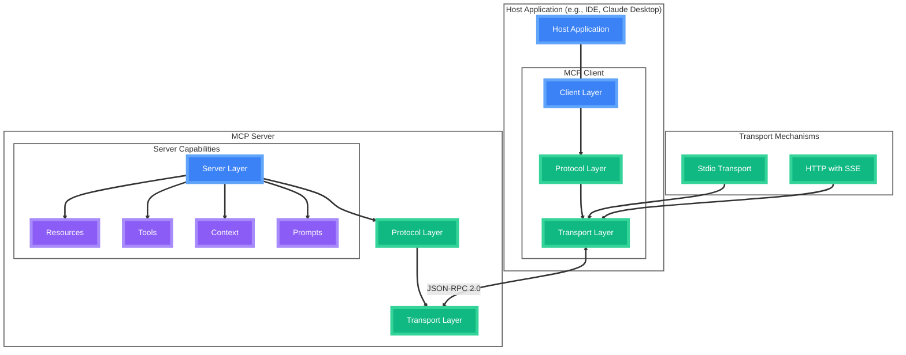

# Model Context Protocol

<!-- 

  <h2 class="text-6xl font-bold text-transparent bg-clip-text bg-gradient-to-r from-green-400 to-blue-500">
    Seamless AI Integration
  </h2>

 -->

  <a href="https://modelcontextprotocol.io" target="_blank" alt="MCP Website"
    class="text-xl icon-btn opacity-50 !border-none !hover:text-white">
    <i-carbon-logo-github />
  </a>

<!--
Presenter note: Welcome slide with gradient text effect
-->

---
layout: image-right
image: 'https://becomposable.com/hubfs/AI-Software-Marketscape-2025-01.jpg'
---

# The Challenge

<v-clicks>

  

    <i-carbon-warning-alt class="text-2xl text-red-500"/>
  

  

    
Fragmented AI Landscape

    
Multiple AI providers, each with unique APIs, authentication methods, and data formats, making integration complex and time-consuming.

  

  

    <i-carbon-development class="text-2xl text-orange-500"/>
  

  

    
Complex Integration

    
Diverse tooling, context management, and unique response handling create development overhead for custom implementations.

  

  

    <i-carbon-security class="text-2xl text-yellow-500"/>
  

  

    
Security Concerns

    
Data privacy, access control, and secure communication channels pose critical challenges when integrating AI capabilities.

  

</v-clicks>

  

    <i-carbon-cloud-services class="text-3xl text-red-400 mb-2"/>
    
Growing Number of AI Services

  

  

    <i-carbon-time class="text-3xl text-orange-400 mb-2"/>
    
Increasing application complexity

  

  

    <i-carbon-shield class="text-3xl text-yellow-400 mb-2"/>
    
Development time and costs rise

  

---
layout: fact
---

  <h1 class="text-8xl font-bold text-transparent bg-clip-text bg-gradient-to-r from-green-400 to-blue-500">
    Enter MCP
  </h1>
  
Model Context Protocol

  
The missing standard for AI integration

<!-- 
This is where Model Context Protocol comes in - a standardized approach to solve these challenges.
-->

---
layout: default
transition: slide-up
---

# What is MCP?

 0 }"
>
  

    MCP is an open protocol that enables seamless integration between AI apps and agents and tools and data sources
  

 0" 
  class="relative mt-28 p-6 rounded-lg overflow-hidden animate-fade-in"
>
  

  

    

      

        <i-carbon-api-1 class="text-5xl text-blue-400 inline-block"/>
        <i-carbon-arrow-right class="text-3xl text-gray-400 mx-2 inline-block"/>
        <i-carbon-application-web class="text-5xl text-green-400 inline-block"/>
        
APIs in Web Development

        
Connect applications to data and services

      

      
=

      

        <i-carbon-machine-learning-model class="text-5xl text-purple-400 inline-block"/>
        <i-carbon-arrow-right class="text-3xl text-gray-400 mx-2 inline-block"/>
        <i-carbon-tool-kit class="text-5xl text-pink-400 inline-block"/>
        
MCP in AI Ecosystem

        
Connects AI applications to tools and data

      

    

    <!-- 
    Just as APIs provide a standardized way for web applications to interact with data services, MCP offers a uniform interface for LLMs and generative AI to access tools, context, and data sources - eliminating the need for custom integration with each AI provider.
    -->
  

= 1 }">
  

    

    

      <i-carbon-api class="text-4xl mb-3 text-blue-400"/>
      
Open Standard

      
An open protocol designed for community adoption and extension

    

  

  
  

    

    

      <i-carbon-tool-kit class="text-4xl mb-3 text-green-400"/>
      
Tool Integration

      
Securely connect AI with your application's tools and capabilities

    

  

  
  

    

    

      <i-carbon-data-enrichment class="text-4xl mb-3 text-purple-400"/>
      
Data Access

      
Controlled access to application resources and contextual data

    

  

---
layout: image-right
image: 'servers_screenshot.png'
---

# Growing MCP Support

  

    

    

      

        <i-carbon-repository class="text-4xl text-blue-400 mr-3"/>
        

          
Official MCP Servers Repository

          
11.4k+ stars · 1.2k+ forks · 200+ contributors

        

      

      
Collection of reference MCP servers.

      

        

          <i-carbon-document class="mr-1 text-blue-400"/> GitHub
        

        

          <i-carbon-delivery class="mr-1 text-green-400"/> Jira
        

        

          <i-carbon-shopping-catalog class="mr-1 text-yellow-400"/> PostgreSQL
        

        

          <i-carbon-cloud class="mr-1 text-purple-400"/> Weather
        

        

          <i-carbon-search class="mr-1 text-red-400"/> Google
        

        

          <i-carbon-folder class="mr-1 text-orange-400"/> FileSystem
        

      

    

  

  

    

    

      

        <i-carbon-connect class="text-4xl text-green-400 mr-3"/>
        

          
Community-Created Servers

          
500+ servers in the awesome-mcp-servers list

        

      

      

        

          <i-carbon-diagram class="text-teal-400 mt-1 mr-2 flex-shrink-0"/>
          

            
JetBrains

          

        

        

          <i-carbon-network-3 class="text-blue-400 mt-1 mr-2 flex-shrink-0"/>
          

            
Bluesky

          

        

        

          <i-carbon-currency-bitcoin class="text-yellow-400 mt-1 mr-2 flex-shrink-0"/>
          

            
Binance

          

        

        

          <i-carbon-document-pdf class="text-red-400 mt-1 mr-2 flex-shrink-0"/>
          

            
Box

          

        

      

    

  

<!-- 
Right side placeholder:
In the layout: image-right format, you need to replace the image: '#' with the actual screenshot URL.
Example: image: 'path/to/mcp-servers-screenshot.png'
-->

<!--
This slide showcases the rapidly growing ecosystem of MCP servers. The official MCP servers repository has gained incredible traction with over 11,000 stars and 1,200+ forks on GitHub, demonstrating strong community interest. The community has extended beyond the official implementations, with hundreds of third-party servers being developed for diverse use cases from social media integration to financial services.
-->

---
layout: default
---

# Core Architecture

  

    

    

      <i-carbon-application-web class="text-3xl mb-2 text-blue-400"/>
      
Host Layer

      
LLM Applications that want to access data through MCP

    

  

  

    

    

      <i-carbon-connect class="text-3xl mb-2 text-green-400"/>
      
Client Layer

      
Maintains and manages 1:1 connections to MCP Servers

    

  

  

    

    

      <i-carbon-machine-learning-model class="text-3xl mb-2 text-purple-400"/>
      
Server Layer

      
Provides data, tools and prompts to Clients

    

  

---
layout: default
---

# Key Components

  

    

    

      <h3 class="text-xl font-bold mb-4 text-blue-400">Protocol Layer</h3>
      

        

          <i-carbon-data-share class="mr-2 text-blue-400"/> Message Framing & Routing
        

        

          <i-carbon-connect class="mr-2 text-blue-400"/> Request/Response Management
        

        

          <i-carbon-flow class="mr-2 text-blue-400"/> Communication Patterns
        

        

          <i-carbon-certificate class="mr-2 text-blue-400"/> Versioned Protocol Schemas
        

      

    

  

  

    

    

      <h3 class="text-xl font-bold mb-4 text-purple-400">Transport Layer</h3>
      

        

          <i-carbon-code class="mr-2 text-purple-400"/> JSON-RPC 2.0 Wire Format
        

        

          <i-carbon-data-transformer class="mr-2 text-purple-400"/> Protocol Message Transmission
        

        

          <i-carbon-terminal class="mr-2 text-purple-400"/> Multiple Transport Methods
        

        

          <i-carbon-plug class="mr-2 text-purple-400"/> Extensible Channel System
        

      

    

  

  

    

    

      

        

          
Model-controlled

          <i-carbon-tool-kit class="text-3xl mb-2 mx-auto text-yellow-400"/> 
          
Tools

          
Functions invoked by the model

          

            
Retrieve / search

            
Send a message

            
Update DB records

          

        

        

          
Application-controlled

          <i-carbon-document class="text-3xl mb-2 mx-auto text-yellow-400"/> 
          
Resources

          
Data exposed to the application

          

            
Files

            
Database Records

            
API Responses

          

        

        

          
User-controlled

          <i-carbon-text-creation class="text-3xl mb-2 mx-auto text-yellow-400"/> 
          
Prompts

          
Pre-defined templates for AI interactions

          

            
Document Q&A

            
Transcript Summary

            
Workflow Automation

          

        

      

    

  

<!--
Speaker notes:

The Protocol Layer and Transport Layer have distinct responsibilities in MCP:

- Protocol Layer: Handles the logical aspects of communication
  - Message framing: Structures messages in a consistent format
  - Request/response linking: Ensures requests are matched with corresponding responses
  - Communication patterns: Manages high-level communication flows between clients and servers
  - Schema validation: Validates messages against versioned schemas

- Transport Layer: Handles the physical communication mechanisms
  - Implements specific transport methods (Stdio, HTTP/SSE, WebSockets)
  - Uses JSON-RPC 2.0 as the wire format for message exchange
  - Converts MCP protocol messages into JSON-RPC format for transmission
  - Converts received JSON-RPC messages back into MCP protocol messages

Think of the Protocol Layer as defining "what" messages mean, while the Transport Layer determines "how" they are delivered. The Protocol Layer is transport-agnostic, allowing MCP to work across different communication channels.
-->

---
layout: default
transition: slide-up
---

# Sampling in MCP

 0 }"
>
  

    Enabling sophisticated agentic behaviors while maintaining security and privacy
  

= 1 }">
  

    

    

      <h3 class="text-xl font-bold mb-4 text-orange-400">What is MCP Sampling?</h3>
      

        

          <i-carbon-ibm-watson-knowledge-studio class="mr-2 text-orange-400 mt-1 flex-shrink-0"/> 
          Allows Servers to request LLM completions through Client
        

        

          <i-carbon-user-role class="mr-2 text-orange-400 mt-1 flex-shrink-0"/> 
          Human-in-the-loop design
        

        

          <i-carbon-data-reference class="mr-2 text-orange-400 mt-1 flex-shrink-0"/> 
          Contextual awareness with controlled data sharing
        

        

          <i-carbon-data-reference class="mr-2 text-orange-400 mt-1 flex-shrink-0"/> 
          Conversation history, Model preferences and prompts
        

      

    

  

  

    

    

      <h3 class="text-xl font-bold mb-4 text-teal-400">Agentic Capabilities</h3>
      

        

          <i-carbon-document-sentiment class="mr-2 text-teal-400 mt-1 flex-shrink-0"/> 
          Reading and analyzing resources with context awareness
        

        

          <i-carbon-decision class="mr-2 text-teal-400 mt-1 flex-shrink-0"/> 
          Making intelligent decisions based on contextual data
        

        

          <i-carbon-data-structured class="mr-2 text-teal-400 mt-1 flex-shrink-0"/> 
          Generating structured data and formatted responses
        

        

          <i-carbon-workflow-automation class="mr-2 text-teal-400 mt-1 flex-shrink-0"/> 
          Handling multi-step tasks with interactive assistance
        

      

    

  

= 1 }">
  

    

    

      <h3 class="text-center text-lg font-bold mb-3 text-blue-400">Sampling Flow</h3>
      

        

          

            <i-carbon-server class="text-3xl mb-1 mx-auto text-purple-400"/>
            
Server Requests Completion

          

          <i-carbon-arrow-right class="text-gray-400"/>
          

            <i-carbon-user-admin class="text-3xl mb-1 mx-auto text-blue-400"/>
            
Client Reviews Request

          

          <i-carbon-arrow-right class="text-gray-400"/>
          

            <i-carbon-machine-learning-model class="text-3xl mb-1 mx-auto text-green-400"/>
            
LLM Generates Response

          

          <i-carbon-arrow-right class="text-gray-400"/>
          

            <i-carbon-user-role class="text-3xl mb-1 mx-auto text-yellow-400"/>
            
Client Reviews Output

          

          <i-carbon-arrow-right class="text-gray-400"/>
          

            <i-carbon-application-web class="text-3xl mb-1 mx-auto text-red-400"/>
            
Result Returns to Server

          

        

      

    

  

<!--
This slide explains MCP sampling as a powerful feature enabling servers to request LLM completions through clients, facilitating sophisticated agentic workflows while maintaining human oversight. The human-in-the-loop design ensures users maintain control over what the LLM sees and generates, balancing powerful automation with security and privacy.
-->

---
layout: default
---

# MCP in Action: Demo

  

    See how MCP sampling enables powerful agentic workflows in real-world applications
  

  

    <!-- Video will be embedded here -->
    

      <i-carbon-play-filled class="text-5xl text-gray-600 mb-3"/>
      
Video placeholder

      
Video will be added here

    

    
    <!-- Uncomment and update the src when you have the video -->
    <!-- 
    <video 
      controls
      class="w-full h-full object-cover"
      poster="path/to/optional-poster-image.jpg">
      <source src="path/to/your-video.mp4" type="video/mp4">
      Your browser does not support the video tag.
    </video>
    -->
  

<!--
This slide demonstrates MCP in action with a real-world example. The video shows how sampling enables sophisticated agentic behaviors while maintaining user control.
-->

---
layout: default
---

# The Future of MCP

  

    <strong>THE POWER OF MCP IS ONLY GOING TO GROW</strong>
    

    

    The current development road map looks like:
  

  

    

    

      <h3 class="text-xl font-bold mb-4 text-blue-400">Remote MCP Support</h3>
      

        

          <i-carbon-security class="mr-2 text-blue-400 mt-1 flex-shrink-0"/> 
          Authentication & Authorization with OAuth 2.0
        

        

          <i-carbon-network-4 class="mr-2 text-blue-400 mt-1 flex-shrink-0"/> 
          Service Discovery for remote connections
        

        

          <i-carbon-cloud class="mr-2 text-blue-400 mt-1 flex-shrink-0"/> 
          Stateless operations for serverless environments
        

      

    

  

  

    

    

      <h3 class="text-xl font-bold mb-4 text-green-400">Advanced Agent Support</h3>
      

        

          <i-carbon-tree-view-alt class="mr-2 text-green-400 mt-1 flex-shrink-0"/> 
          Hierarchical agent systems with namespacing
        

        

          <i-carbon-flow class="mr-2 text-green-400 mt-1 flex-shrink-0"/> 
          Interactive workflows with permission management
        

        

          <i-carbon-data-player class="mr-2 text-green-400 mt-1 flex-shrink-0"/> 
          Streaming results for real-time agent operations
        

      

    

  

  

    

    

      <i-carbon-package class="text-3xl mb-2 text-yellow-400"/>
      
Distribution & Discovery

      
Standardized packaging and server registry

    

  

  
  

    

    

      <i-carbon-video class="text-3xl mb-2 text-purple-400"/>
      
Additional Modalities

      
Expanding beyond text to audio, video, and more

    

  

  
  

    

    

      <i-carbon-collaborate class="text-3xl mb-2 text-red-400"/>
      
Community-Led Standards

      
Open governance and standardization initiatives

    

  

<!--
This slide outlines the future roadmap for MCP, highlighting key initiatives planned for 2025 and beyond. The focus areas include enabling remote connections, enhancing agent capabilities, improving distribution mechanisms, supporting new modalities beyond text, and fostering community-led standards development. These initiatives aim to make MCP more accessible, powerful, and widely adopted across the AI ecosystem.
-->